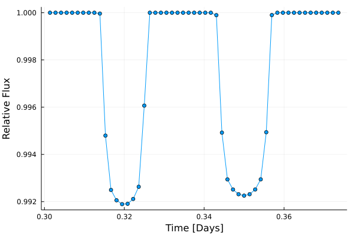

# Photodynamics

[comment]: <[](https://langfzac.github.io/Photodynamics.jl/stable)>
[comment]: <[](https://langfzac.github.io/Photodynamics.jl/dev)>
[](https://github.com/langfzac/Photodynamics.jl/actions)
[](https://codecov.io/gh/langfzac/Photodynamics.jl)


A differentiable photodynamics code built on [NbodyGradient.jl](https://github.com/ericagol/NbodyGradient.jl) and [Limbdark.jl](https://github.com/rodluger/limbdark.jl), and methods from [Parviainen & Korth (2020)](https://ui.adsabs.harvard.edu/abs/2020MNRAS.499.3356P/abstract).

# Installation

You can install `Photodynamics.jl` in the usual way -- via [`Pkg.jl`](https://github.com/JuliaLang/Pkg.jl).
```julia
pkg> add Photodynamics
```

# Basic Usage

This package is very much still in-progress. The below is a simple working example using the current API, which is likely to change soon.

```julia
using Photodynamics, Plots

# Setup a simple 3 body system using NbodyGradient.jl initial conditions
# Distance: AU
# Time: Days
# Masses: Solar Masses
# Angles: radians
N = 3
t0 = 0.0
star = Elements(m = 1)
planet_b = Elements(m = 3e-5, P = 1.5, t0=0.32, ecosω = 0.03, I =  π/2)
planet_c = Elements(m = 6e-5, P = 2.4, t0=0.35, ecosω = 0.02, I =  π/2)
ic = ElementsIC(t0, N, star, planet_b, planet_c)

# Stellar/transit properties
rstar = 0.00465047 * 0.1192 # Trappist-1 (Rstar/AU)
k = [0.085, 0.083]  # Radius ratios
u_n = [0.28, 0.11]  # Limbdarkening coefficients

# Setup simulated lightcurve
cadence = 2 / 60 / 24  # 2 minute cadence in days
obs_duration = 2.0  # Duration of observations in days
obs_times = collect(t0:cadence:obs_duration)
lc = Lightcurve(cadence, obs_times, ones(length(obs_times)), zeros(length(obs_times)), u_n, k, rstar)

# Compute the dynamical model
intr = Integrator(0.05, obs_duration)
s = State(ic)
ts = TransitSeries(obs_duration, ic)
tt = TransitTiming(obs_duration, ic)
intr(s, ts, tt; grad=false)

# Compute the photometry
compute_lightcurve!(lc, ts)

# Make a, not very glamorous, plot of the lightcurve
mask = 0.3 .< lc.tobs .< 0.375
plot(lc.tobs[mask], lc.flux[mask] .+ 1, legend=false, marker=true)
xlabel!("Time [Days]"); ylabel!("Relative Flux")
```


