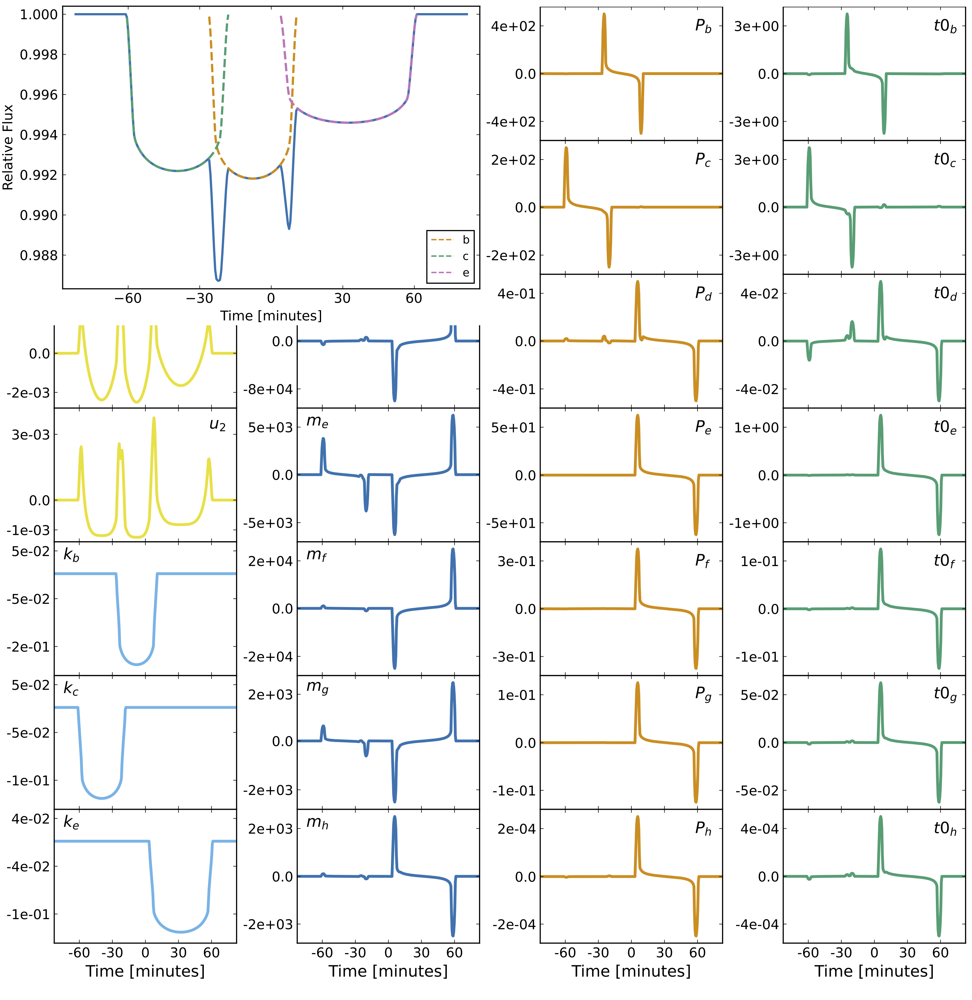

# Photodynamics.jl

[comment]: <>
[comment]: <>

 
 \

A differentiable photodynamics code built on [NbodyGradient.jl](https://github.com/ericagol/NbodyGradient.jl) and [Limbdark.jl](https://github.com/rodluger/limbdark.jl), and methods from [Parviainen & Korth (2020)](https://ui.adsabs.harvard.edu/abs/2020MNRAS.499.3356P/abstract).

